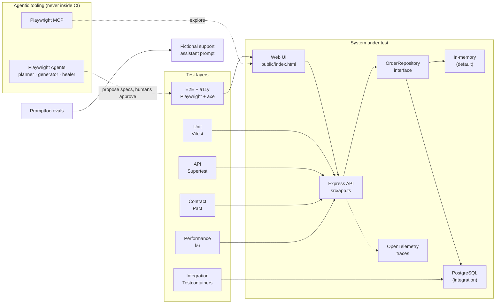

# Modern Quality Engineering Lab

[](https://github.com/cozgur/modern-quality-engineering-lab/actions/workflows/ci.yml)
[](https://github.com/cozgur/modern-quality-engineering-lab/actions/workflows/performance.yml)
[](LICENSE)


A production-style, vendor-neutral showcase of how a modern SDET chooses **the right test layer for each risk**,
built around a deliberately small TypeScript service.

Nine quality layers, one coherent system: unit, in-process API, contract (Pact), integration with a real
PostgreSQL (Testcontainers), browser E2E and accessibility (Playwright + axe-core), performance (k6),
AI evaluation (Promptfoo), observability (OpenTelemetry) and agent-assisted test authoring (Playwright Agents + MCP),
all wired into a parallel GitHub Actions pipeline.

> No company code or private domain knowledge is included. The app exists to be tested.
> It is also the default demo target of [TestPlan Studio](https://github.com/cozgur/testplan-studio),
> a companion project that turns a brief into a risk-based plan and a lint-gated Playwright spec, then runs it on Actions.

## Start here

| Time you have | Where to look |
|---|---|
| 1 minute | The layer map below and the green CI badge above. |
| 5 minutes | [`tests/e2e/checkout.spec.ts`](tests/e2e/checkout.spec.ts) (UI claim verified through the API, failure paths via network mocking), [`tests/api/app.test.ts`](tests/api/app.test.ts) (HTTP error handling), [`tests/integration/postgres.test.ts`](tests/integration/postgres.test.ts) (database-enforced invariants). |
| 15 minutes | [`docs/test-strategy.md`](docs/test-strategy.md) for the placement rules, then the [decision records](docs/adr/README.md) for the trade-offs. |

## What this demonstrates

| Layer | Technology | What it proves here |
|---|---|---|
| Unit | Vitest | Table-driven boundary tests for checkout validation |
| API (in-process) | Vitest + Supertest | Routing, JSON parsing, 400 vs 500 handling, dependency injection of a failing repository |
| Contract | Pact v4 | Consumer-driven contract + provider verification against the real Express app |
| Integration | Testcontainers + PostgreSQL 16 | Real `CHECK` and primary-key constraints, full HTTP-to-database path |
| Browser E2E | Playwright | Critical journey, verified server-side; API failures mocked at the network layer |
| Accessibility | axe-core + Playwright | WCAG A/AA scan before and after interaction, results attached to the report |
| Performance | k6 + k6 browser | Latency/error thresholds, scheduled instead of per-commit |
| AI evaluation | Promptfoo | Deterministic assertions on a probabilistic support assistant |
| Observability | OpenTelemetry | Node auto-instrumentation with console trace export |
| Agentic tooling | Playwright Agents + MCP | Planner / generator / healer workflow with human approval gates |
| Delivery | GitHub Actions, Dependabot | Four parallel CI jobs, pinned dependencies, grouped update PRs |

## Architecture



The HTTP layer depends only on an `OrderRepository` interface. That single seam is what lets the same
API tests run against the in-memory implementation in milliseconds and against real PostgreSQL in the
integration suite ([ADR-0002](docs/adr/0002-in-memory-repository-by-default.md)).

## Quick start

Requirements: Node 22 (`.nvmrc`), npm, Docker (integration tests only), k6 (performance only).

```bash
npm ci
npx playwright install --with-deps chromium

npm run check            # lint + format + typecheck + unit + API tests
npm run test:contract    # Pact consumer, then provider verification
npm run test:e2e         # Playwright E2E + accessibility (starts the app itself)
npm run test:integration # needs Docker
```

Run the app on its own with `npm run dev` and open <http://127.0.0.1:3000>.
Run it with traces using `npm run dev:otel`.

## The layers in detail

### Unit and API tests (Vitest, Supertest)

```bash
npm run test:unit
npm run test:api
npm run test:coverage    # enforces 90% line / 85% branch thresholds on src/
```

What to notice:

- [`src/checkout.ts`](src/checkout.ts) is a pure function, so every boundary (`0`, `1`, `100`, `101`, `1.5`, `"2"`) is one table row in [`tests/unit/checkout.test.ts`](tests/unit/checkout.test.ts).
- [`tests/api/app.test.ts`](tests/api/app.test.ts) proves malformed JSON returns `400`, not `500`, and that a throwing repository surfaces as a JSON `500` rather than a crash. Neither of those belongs in a browser test.

### Contract tests (Pact)

```bash
npm run test:contract
```

The consumer test declares the shape [`src/user-client.ts`](src/user-client.ts) depends on and writes a pact.
The provider test starts the real Express app and replays that pact against it. Pacts are generated
per run and uploaded as a CI artifact rather than committed ([ADR-0003](docs/adr/0003-pacts-generated-not-committed.md)).

### Integration tests (Testcontainers + PostgreSQL)

```bash
npm run test:integration
```

A disposable `postgres:16-alpine` container is started once per file. The tests prove things a mock
cannot: the `CHECK (quantity > 0)` constraint rejects bad data even when application validation is
bypassed (`23514`), duplicate ids hit the primary key (`23505`), and a checkout through the HTTP API
lands in the table.

### Browser E2E and accessibility (Playwright, axe-core)

```bash
npm run test:e2e
npm run test:a11y
```

What to notice in [`tests/e2e/checkout.spec.ts`](tests/e2e/checkout.spec.ts):

- Role-based locators and web-first assertions only. No CSS paths, no sleeps.
- The happy path reads the order id from the page and then **fetches the order through the API**, so the assertion is on system state, not on text.
- Two failure paths are created with `page.route`: a JSON `503` and a non-JSON `502` error page. Both must produce a clear message and re-enable the button.

The accessibility spec attaches the full axe result to the HTML report and scans **after** the
status region updates, not only on first load.

### Performance (k6)

```bash
npm run test:perf:api        # protocol-level, p(95) < 250 ms, error rate < 1%
npm run test:perf:browser    # k6 browser module, rendering check
```

Performance runs weekly and on demand in the [`performance`](.github/workflows/performance.yml) workflow,
never as a per-commit gate. Results on shared CI runners are indicative, not a benchmark.

### AI evaluation (Promptfoo)

```bash
OPENAI_API_KEY=... npm run eval:ai
```

[`promptfoo/promptfooconfig.yaml`](promptfoo/promptfooconfig.yaml) evaluates a fictional support assistant
with deterministic checks: valid JSON, required escalation on duplicate charges, and refusal of requests
for another customer's data. The [`ai-eval`](.github/workflows/ai-eval.yml) workflow runs on demand and
skips cleanly when no API key is configured.

### Observability (OpenTelemetry)

```bash
npm run dev:otel
```

Node auto-instrumentation exports spans to the console so the demo stays self-contained. The point is
diagnosability: a browser symptom can be correlated with a backend span instead of re-running the suite.

### Agentic testing (Playwright Agents, MCP)

```bash
npm run agents:claude    # or agents:codex / agents:vscode
npm run mcp
```

Agents plan, generate and heal; humans approve intent; CI stays deterministic.
The workflow and its guardrails are in [`docs/agentic-testing.md`](docs/agentic-testing.md) and
[ADR-0004](docs/adr/0004-agents-propose-humans-approve.md).

## CI pipeline

Four independent jobs run in parallel on every push and pull request
([`ci.yml`](.github/workflows/ci.yml)):

| Job | Runs | Artifact |
|---|---|---|
| Lint, types, unit & API tests | ESLint, Prettier, `tsc`, Vitest with coverage thresholds | `coverage/` |
| Pact consumer + provider | consumer contract, then provider verification | generated pact |
| Integration | Testcontainers PostgreSQL | |
| Browser E2E + accessibility | Playwright with `github` annotations, trace on first retry | Playwright HTML report |

Separate workflows: [`performance`](.github/workflows/performance.yml) (weekly + manual, k6) and
[`ai-eval`](.github/workflows/ai-eval.yml) (manual, Promptfoo). Dependencies are pinned exactly and
[Dependabot](.github/dependabot.yml) opens grouped weekly PRs.

## Design decisions

| ADR | Decision |
|---|---|
| [0001](docs/adr/0001-risk-based-layer-selection.md) | Choose the test layer by the risk it addresses |
| [0002](docs/adr/0002-in-memory-repository-by-default.md) | In-memory repository by default, PostgreSQL where semantics matter |
| [0003](docs/adr/0003-pacts-generated-not-committed.md) | Pacts are generated in CI, not committed |
| [0004](docs/adr/0004-agents-propose-humans-approve.md) | Agents propose, humans approve intent |
| [0005](docs/adr/0005-no-visual-regression-baselines.md) | No screenshot baselines |

## Interview talking points

- Why contract tests catch API drift earlier and cheaper than E2E tests, and what they cannot catch.
- When a real database via Testcontainers pays for its ~20 s startup, and when an in-memory double is the right call.
- Why an E2E test should verify a UI claim through the API, and why network-level mocking beats a flaky backend for failure paths.
- Why AI-generated or healed tests still need a human to review test intent, not only a green run.
- Why performance, accessibility and AI evaluation belong to quality engineering but need different oracles and different cadences.

## Non-goals

- Cross-browser matrix (one Chromium project keeps CI fast; adding Firefox/WebKit is a config change).
- Visual regression baselines ([ADR-0005](docs/adr/0005-no-visual-regression-baselines.md)).
- A Pact Broker or `can-i-deploy` gate, which only make sense across repositories.
- Production hardening of the sample app itself. It is a test target, not a product.

## Roadmap

- [ ] Publish the Playwright HTML report to GitHub Pages on `main`.
- [ ] Add a mutation-testing run (Stryker) to measure the unit suite, not just cover it.
- [ ] Add an OTLP exporter option so traces can be viewed in Jaeger locally via Docker Compose.

## Author

**Özgür Çetintaş**, Rotterdam. Test automation and quality engineering.
GitHub: [@cozgur](https://github.com/cozgur)

## License

[MIT](LICENSE)
